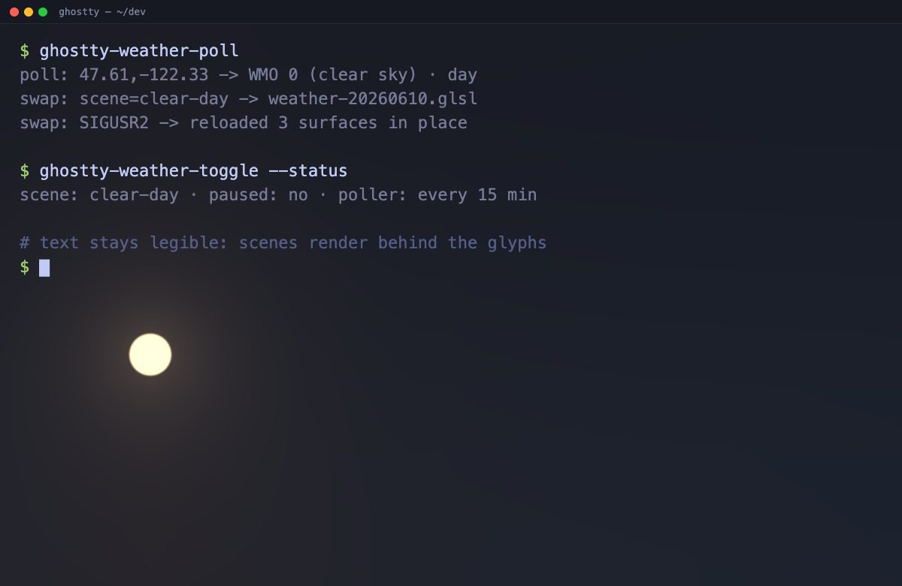
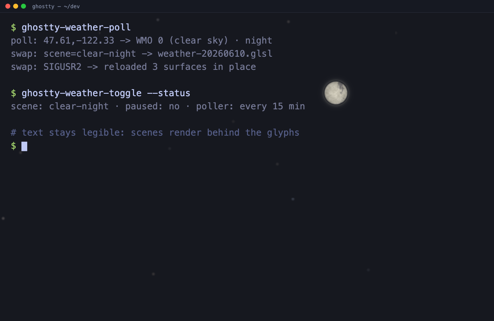
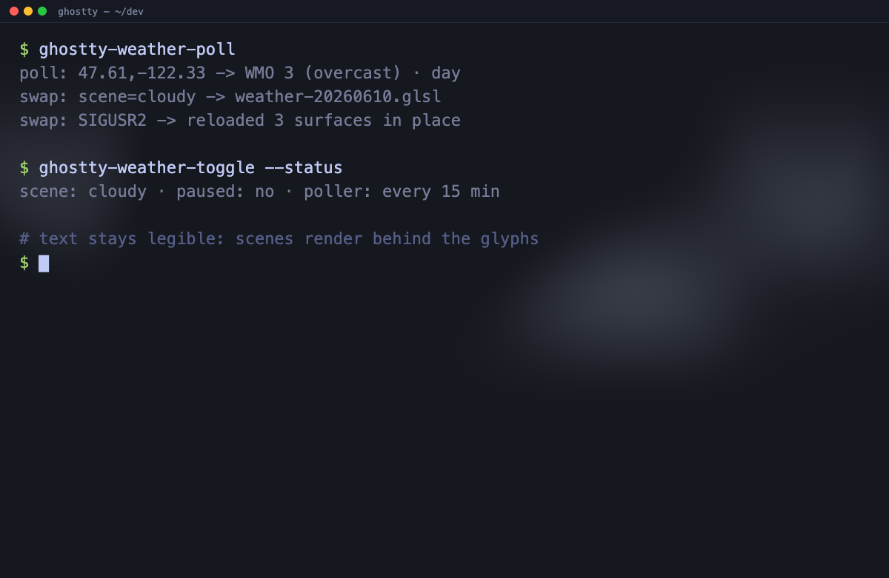
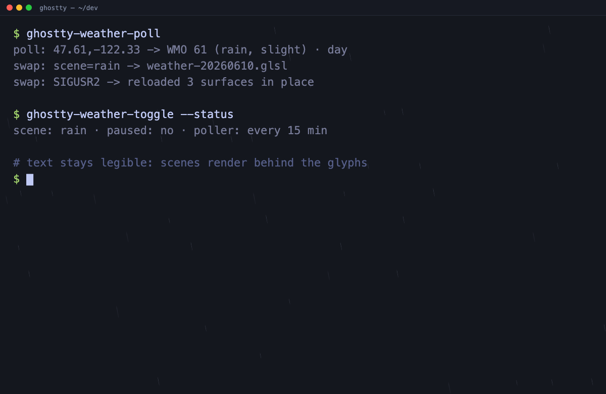
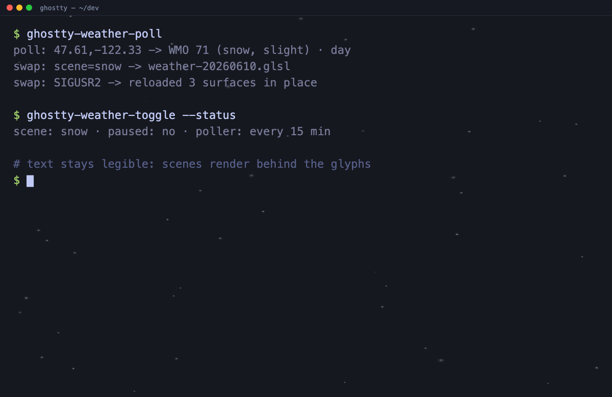
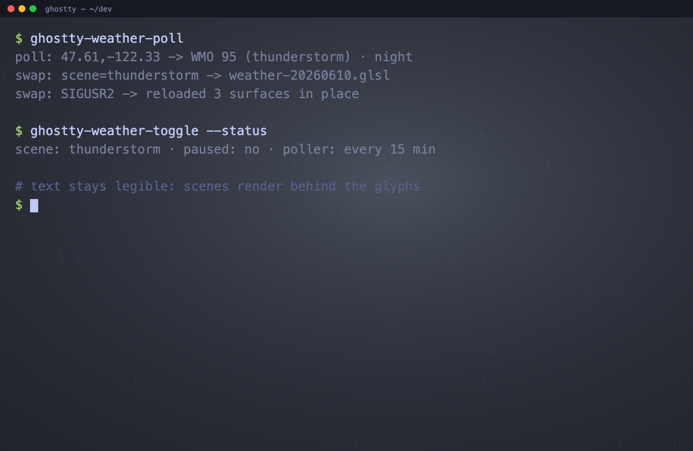

# ghostty-weather


Live, weather-driven background shaders for the [Ghostty](https://ghostty.org)
terminal. A small daemon polls your local weather every 15 minutes and swaps
Ghostty's `custom-shader` to match — clear day, clear night (with a
phase-accurate moon), clouds, rain, snow, or thunderstorm — reloading every
open window in place, no restart.

Text stays fully legible: every scene renders **behind** the terminal contents
and lets the glyph layer pass through untouched.

**[Live demo →](https://an0sunshy.github.io/ghostty-weather/)** — every scene
running in your browser, with moon-phase, time-of-day, and day/night
controls. The gallery compiles the **exact** `.glsl` files Ghostty runs,
wrapped in a short WebGL2 preamble — scenes are written in the
[portable GLSL subset](docs/shader-portability.md) and CI validates every
one under both the desktop GL and WebGL2 profiles.

## Screenshots

Captured from the [live gallery](https://an0sunshy.github.io/ghostty-weather/) —
the exact scene shaders compositing behind a simulated terminal screenful,
at deterministic timestamps (`scripts/capture-assets.sh` regenerates them).

| | |
|---|---|
|  |  |
|  |  |
|  |  |

> Contributors: real terminal captures (and a short GIF of a live swap) are
> welcome additions under `assets/`.

---

## How it works

```text
 ┌─ ghostty-weather-poll ─┐      ┌─ ghostty-weather-swap ─┐      ┌─ Ghostty ─┐
 │ Open-Meteo current     │      │ pick scene .glsl       │      │ reload    │
 │ weather + is_day  ─────┼─────▶│ bake moon-phase/time   │─────▶│ config    │
 │ (LaunchAgent, 15 min)  │      │ write active.conf      │      │ recompile │
 └────────────────────────┘      │ kill -USR2 ghostty ────┼─────▶│ shader    │
                                  └────────────────────────┘      └───────────┘
```

1. **`ghostty-weather-poll`** fetches the current condition from Open-Meteo
   (free, no API key) for your location and maps the
   [WMO weather code](https://open-meteo.com/en/docs) + day/night flag to a scene.
2. **`ghostty-weather-swap`** copies that scene to a fresh file under
   `~/Library/Caches/ghostty-weather/`, bakes in the current time-of-day and
   moon phase as `#define`s, and points `active.conf` at it.
3. **Ghostty** reloads on `SIGUSR2` and recompiles the shader for every open
   surface — the new sky appears within a frame.

If a scene fails to compile, the swap catches it in Ghostty's log and reverts to
the previous one, so a bad edit never leaves you shaderless.

## Requirements

- **Ghostty** with `SIGUSR2` config-reload support (tested on 1.3.1).
- **macOS** for the automatic poller (`launchd`) and the compile-validation
  step (`/usr/bin/log`). The shaders and the manual `swap`/`toggle`/`demo`
  commands work on Linux Ghostty too — see [Cross-platform](#cross-platform).
- `curl`. `jq` is optional (used if present; there's a grep fallback).

## Install

```sh
git clone https://github.com/an0sunshy/ghostty-weather.git ~/dev/ghostty-weather
cd ~/dev/ghostty-weather
./install.sh                 # links commands + wires the Ghostty include
# or, in one shot, also start the auto-poller:
./install.sh --with-poller
```

`install.sh` symlinks the commands into `~/.local/bin` and adds an absolute
`config-file = ?…/active.conf` line to Ghostty's always-loaded secondary
config (`~/Library/Application Support/com.mitchellh.ghostty/config` on macOS),
so it works regardless of how your main config is managed.

## Usage

```sh
ghostty-weather-swap clear-night     # apply a scene now (manual)
ghostty-weather-toggle               # pause / resume the shader
ghostty-weather-toggle --status      # show current scene / paused state
ghostty-weather-poll                 # poll once and swap to match weather
ghostty-weather-poll --install       # install the 15-min LaunchAgent
ghostty-weather-poll --uninstall     # remove it
ghostty-weather-demo [seconds]       # cycle every scene for a visual review
ghostty-weather-moon-demo [seconds]  # cycle clear-night through all 8 lunar phases
```

Scenes: `clear-day` · `clear-night` · `cloudy` · `rain` · `snow` ·
`thunderstorm` (fog maps to `cloudy` for now).

## Configuration

Location and behavior live in `~/.config/ghostty-weather/config.env`:

```sh
# Pick ONE location source.
# Direct coordinates — never calls any third party for location:
LAT=47.6062
LON=-122.3321
# ...or a city / US ZIP, geocoded ONCE via Open-Meteo and cached forever:
LOCATION="Seattle, WA"     # or: LOCATION=98101

# Pause the shader on battery, resume on AC (opt-in):
PAUSE_ON_BATTERY=true
```

Or set the location interactively:

```sh
ghostty-weather-poll --set-city "Seattle, WA"
```

Direct `LAT`/`LON` make **zero** third-party calls. A city/ZIP is geocoded a
single time and cached in `location.json`; subsequent polls reuse it.

### Weather → scene mapping

| WMO codes | Scene |
|---|---|
| 0, 1 | `clear-day` / `clear-night` (by `is_day`) |
| 2, 3, 45, 48 | `cloudy` |
| 51–67, 80–82 | `rain` |
| 71–77, 85, 86 | `snow` |
| 95, 96, 99 | `thunderstorm` |

### Moon phases

`clear-night` renders the moon with a real, phase-accurate terminator. The
phase is computed at swap time from the synodic cycle (29.53 days) and baked
into the shader as `#define MOON_PHASE` (∈ `[0,1)`: `0` new, `0.25` first
quarter, `0.5` full, `0.75` last quarter). Preview the whole cycle with
`ghostty-weather-moon-demo`.

## Technical notes

- **Why a new filename every swap.** Ghostty's renderer treats `custom-shader`
  changes by path; rotating the filename on each swap guarantees the reload is
  picked up rather than skipped, and keeps a previous shader file alive while
  another surface may still be compiling it (the cache keeps the 10 most
  recent).
- **Why baked `#define`s instead of uniforms.** Time-of-day and moon phase are
  injected as `#define`s because Ghostty does not expose a date/clock uniform
  (`iDate`) to custom shaders. Scenes guard each macro with `#ifndef`, so they
  also compile stand-alone.
- **Symlink-safe.** The commands resolve their own real path (following
  `~/.local/bin` symlinks with portable `readlink`), so the bundled scenes are
  found no matter how the command was invoked.

## Performance

These shaders run a full-screen fragment pass every frame the terminal is
visible, so the gate is GPU time as a percentage of the display's per-frame
budget (8.33 ms at 120 Hz). Every scene is kept under **5%**, and CI enforces it.

```sh
bench/run-bench.sh            # build + benchmark all scenes at 3456×2234
```

Snapshot at 3456×2234 / 120 Hz on an M1 Max (% of the 8.33 ms frame budget):

| scene | % budget | | scene | % budget |
|---|---|---|---|---|
| clear-day | 2.2% | | snow | 3.2% |
| rain | 2.5% | | clear-night | 3.6% |
| thunderstorm | 3.1% | | cloudy | 4.6% |

Three scenes started well over budget (clear-night 23%, cloudy 18%, snow 6%) and
were optimized down without changing their look. The headless harness, the
OpenGL-over-Metal caveat, and how to tune a scene are documented in
**[docs/performance.md](docs/performance.md)**.

## Cross-platform

The pipeline is macOS-first. The poller (`launchd`), battery awareness
(`pmset`), and compile-validation (`/usr/bin/log`) are macOS-specific; on Linux
the swap still applies and reloads, it just skips those steps. To use the
shaders on a Linux Ghostty host, run `./install.sh` (it targets
`~/.config/ghostty/config`) and drive scenes manually or from your own
scheduler.

## Uninstall

```sh
./install.sh --uninstall     # removes symlinks, the include, and the LaunchAgent
```

Runtime state under `~/.config/ghostty-weather/` and
`~/Library/Caches/ghostty-weather/` is left intact; delete it manually if you
want a clean slate.

## Contributing & quality

Contributions are welcome — new scenes especially. Start with
[`CONTRIBUTING.md`](CONTRIBUTING.md) for dev setup and the
[`docs/scene-authoring.md`](docs/scene-authoring.md) guide for the uniform list,
baked `#define`s, and the legibility-and-performance conventions every scene
must follow. Two gates are non-negotiable: the **compute gate**
(`bench/run-bench.sh`, every scene under 5% of the frame budget) and the
**golden-image** check. The decision logic (weather→scene mapping, moon
phase, config parsing) is unit-tested by `tests/run-tests.sh`, which runs
in CI on Linux. Beyond CI, the repo keeps a panel of review personas —
reproducible Claude Code reviewers that judge what CI can't.

- [`CONTRIBUTING.md`](CONTRIBUTING.md) — dev setup, adding a scene, commit style
- [`docs/scene-authoring.md`](docs/scene-authoring.md) — shader conventions
- [`docs/performance.md`](docs/performance.md) — the compute gate, harness, and tuning
- [`bench/run-bench.sh`](bench/run-bench.sh) — the compute gate (see [Performance](#performance))
- [`docs/review-personas.md`](docs/review-personas.md) — the review panel

## License

MIT — see [LICENSE](LICENSE).

## Layout

```text
bin/          the five ghostty-weather-* commands (swap, poll, toggle, demos)
shaders/      the six scene shaders (.glsl) + portable GLSL helpers
web/          the WebGL2 scene gallery (the GitHub Pages demo)
bench/        headless GPU timing + golden-image harness (the compute gate)
scripts/      gallery site build / serve + asset capture
tests/        unit tests for the decision logic (CI: ubuntu)
docs/         scene authoring, shader portability, performance, review panel
```

Full file-by-file tree: [CONTRIBUTING.md → Repo layout](CONTRIBUTING.md#repo-layout).
