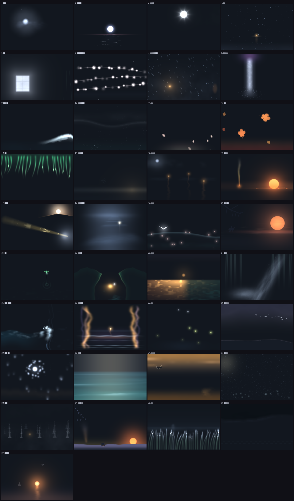
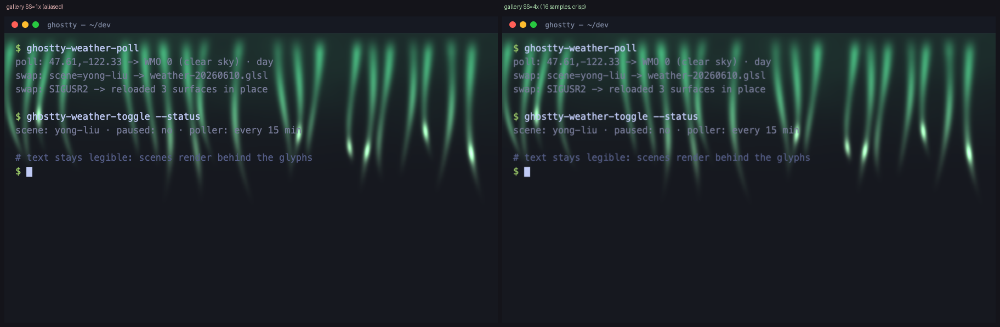

# POC: 唐诗 / 宋词 意境 — animated poem backgrounds

**Status: POC for the shipped `poems` collection — 37 scenes built, 24 kept after curation.**
24 animated GLSL terminal backgrounds (of 37 built), each evoking the 意境 of one famous
classical Chinese poem. Built and refined by multi-agent orchestration — curation rounds
(curators by thematic lens → synthesis), parallel build rounds (one agent per poem: write +
validate + self-render + judge), a judge-and-repair pass, and performance-gating passes. All
are luminous-on-dark and built on 留白 (negative space): light is concentrated in sparse
particles / a focal glow / a horizon band, so the center stays open for legible text.

Two knobs (baked by `ghostty-shaders apply` + gallery controls): `GW_POEM_INTENSITY`
(additive-tint scale) and `GW_SS` (supersample, the compute↔clarity dial — see below).



## The collection (24)

_Numbered by the original 37-scene POC index; the gaps are scenes curated out
before shipping: yong-liu (13), song-meng-haoran (18), yu-ge-zi (19),
mu-jiang-yin (23), zhu-li-guan (24), zao-fa-baidi (26), qing-yu-an (29),
chun-ye-xi-yu (32), jiang-nan-chun (33), yu-jia-ao-qiusi (34), jian-jia (35),
yanmen-taishou (36), ci-beigu (37)._

| # | scene | poem | author | signature line | effect |
|---|---|---|---|---|---|
| 1 | `jing-ye-si` | 靜夜思 | 李白 | 床前明月光，疑是地上霜。 | The luminous parallelogram of moonlight translates and elongates almost imperceptibly across the lower screen as the moon moves; its feathered edge… |
| 2 | `chun-jiang-hua-yue-ye` | 春江花月夜 | 張若虛 | 灩灩隨波千萬里。 | The moon disc eases slowly upward from the bottom edge; its specular 'glitter road' continuously sparkles and breaks apart as wave crests pass — a… |
| 3 | `ba-jiu-wen-yue` | 把酒問月 | 李白 | 皎如飛鏡臨丹闕，綠煙滅盡清輝發。 | On a slow breathing cycle a band of jade-green fog thins to near-nothing; as it clears the moon's bloom and a faint volumetric ray-fan swell to peak… |
| 4 | `jiang-xue` | 江雪 | 柳宗元 | 孤舟蓑笠翁，獨釣寒江雪。 | Sparse, slow snow grains drift straight down with tiny horizontal jitter across the whole frame; the lone boat rocks 2-3px almost imperceptibly; a… |
| 5 | `ye-xue` | 夜雪 | 白居易 | 夜深知雪重，時聞折竹聲。 | A long, almost imperceptible swelling of the window glow = snow deepening. On a long random timer a faint vertical bamboo silhouette bows, then… |
| 6 | `bai-xue-ge` | 白雪歌送武判官歸京 | 岑參 | 忽如一夜春風來，千樹萬樹梨花開。 | Procedural 'blossom' points ignite open in staggered bursts along faint diagonal branch curves, each blooming soft-white with a cool halo then… |
| 7 | `feng-xue-su` | 逢雪宿芙蓉山主人 | 劉長卿 | 柴門聞犬吠，風雪夜歸人。 | Wind-driven snow streaks diagonally at ~30°, gusting in sinusoidal density waves (a real gale, not vertical drift). The lantern sways and its glow… |
| 8 | `wang-lushan-pubu` | 望廬山瀑布 | 李白 | 飛流直下三千尺，疑是銀河落九天。 | The water column streams continuously DOWNWARD (downward-scrolling fBm); fine spray disperses and drifts as particles at the base; the purple… |
| 9 | `lang-tao-sha` | 浪淘沙·其七 | 劉禹錫 | 八月濤聲吼地來，捲起沙堆似雪堆。 | A massive foam-crest line advances fast across the frame, rears and peaks, then recedes — a surge-and-retreat loop; spray particles fling off the… |
| 10 | `yin-hu-shang` | 飲湖上初晴後雨 | 蘇軾 | 水光潋灩晴方好，山色空濛雨亦奇。 | Traveling micro-highlights ripple across the lake (animated specular sparkle following a ripple field); a curtain of fine rain drifts diagonally; the… |
| 11 | `chun-xiao` | 春曉 | 孟浩然 | 夜來風雨聲，花落知多少。 | Individual petals detach and fall on gentle sinusoidal sway paths (the storm already past, so the descent is soft and residual); each fades in at the… |
| 12 | `shan-xing` | 山行 | 杜牧 | 停車坐愛楓林晚，霜葉紅於二月花。 | Maple-leaf glyphs spin and tumble as they fall — rotating, catching gusts, fluttering on a slightly chaotic diagonal descent (heavier, more tumbling… |
| 14 | `qian-tang-hu-chun-xing` | 錢塘湖春行 | 白居易 | 水面初平雲腳低，亂花漸欲迷人眼。 | A calm early-spring lake at dawn: a low water band shimmers just above the bottom edge (水面初平), soft cloud-feet hang low over the far shore and drift sideways, biased to the right; sparse luminous blossom-motes ease downward across the field (亂花), over a faint sand-and-willow shore hint. |
| 15 | `feng-qiao-ye-bo` | 楓橋夜泊 | 張繼 | 月落烏啼霜滿天，江楓漁火對愁眠。 | Two or three warm fishing-fire points flicker and sway gently; each casts a vertical wavering reflection that ripples and stretches on the rippling… |
| 16 | `shi-zhi-sai-shang` | 使至塞上 | 王維 | 大漠孤煙直，長河落日圓。 | The beacon smoke drifts upward as a slow near-vertical luminous filament with a slight heat-haze wobble; the round sun sinks almost imperceptibly… |
| 17 | `deng-guanque-lou` | 登鸛雀樓 | 王之渙 | 白日依山盡，黃河入海流。 | A broad ochre river-band flows steadily DIAGONALLY across the frame toward the far horizon (continuous downstream UV scroll with bright… |
| 20 | `tianjingsha-qiusi` | 天淨沙·秋思 | 馬致遠 | 古道西風，夕陽西下。 | The round setting sun sinks slowly toward the horizon, held right of center, over an empty windswept plain; the west wind (西風) carries a slow dust-haze drift and a bare roadside branch, the dusk deepening — a still, desolate 夕陽西下. |
| 21 | `xiao-chi` | 小池 | 楊萬里 | 小荷才露尖尖角，早有蜻蜓立上頭。 | The dragonfly HOVERS and then lands — darting in small quick movements before settling on the lotus tip, its wings shimmering; faint concentric… |
| 22 | `wang-tianmen-shan` | 望天門山 | 李白 | 兩岸青山相對出，孤帆一片日邊來。 | Two facing cliff silhouettes slowly slide APART and grow (scaling/translating outward toward the frame edges) — the 相對出 illusion of peaks advancing… |
| 25 | `chibi-huai-gu` | 念奴嬌·赤壁懷古 | 蘇軾 | 亂石穿空，驚濤拍岸，捲起千堆雪。 | Successive wave-crests sweep IN toward a fixed vertical cliff edge and SLAM, each collision detonating an upward burst of foam particles that arc up,… |
| 27 | `qiu-xi` | 秋夕 | 杜牧 | 輕羅小扇撲流螢，天階夜色涼如水。 | The drifting, pulsing fireflies are the clear thing-in-motion — several soft glowing points wandering on slow looping paths, brightening and dimming… |
| 28 | `du-zuo-jingting` | 獨坐敬亭山 | 李白 | 孤雲獨去閒，只有敬亭山。 | A single lone cloud drifts slowly and idly across the dusk sky, easing from just right of center out past the frame edge (孤雲獨去閒) and into stillness, over the dark silhouette of 敬亭山 — the quiet, deliberate sole motion. |
| 30 | `guan-canghai` | 觀滄海 | 曹操 | 秋風蕭瑟，洪波湧起。日月之行，若出其中。 | The ENTIRE sea-plane undulates — broad low-frequency swell-lines roll steadily across the frame from horizon toward the viewer, the surface rising… |
| 31 | `teng-wang-ge` | 滕王閣序 | 王勃 | 秋水共長天一色。 | Long soft rose-gold cloud-bands (落霞) drift slowly and horizontally across the upper field above a seamless water-and-sky horizon of one color (秋水共長天一色), the water shimmering faintly below. |

## Configurable compute (supersample dial)

The gallery exposes a **supersample** slider (`GW_SS` = 1–4): it renders `GW_SS×GW_SS`
jittered sub-samples per pixel in the shared epilogue and averages them, anti-aliasing thin
features and moving highlights. `GW_SS=1` is the original single-sample behaviour; higher
tiers cost ~`GW_SS²` more GPU for a crisper image — a live compute↔clarity dial. URL-shareable
(`#…&ss=4`). Gallery-wide via one epilogue change; the Ghostty-side per-scene version is a
follow-up.



## Try it

```sh
./scripts/serve-site.sh            # http://localhost:8642 — pick any poem, watch it move
GHOSTTY_SHADERS_POEM_INTENSITY=0.8 ghostty-shaders apply jiang-xue   # live in Ghostty
```

## Provenance & cost

- Public-domain classical works (Han/Tang/Song/Yuan/Shijing). The GLSL is original work
  matching each poem's imagery/motion; self-contained, house scene contract. Briefs:
  `docs/poc-poetry/poems.json`.
- Verified: tests 123/123 (gallery==scenes invariant for all 30 scenes); glslangValidator
  passes for every poem scene across gl410 + es300 × bare + defines.
- **Compute:** poems are opt-in static art, so the collection carries a higher per-frame
  ceiling than weather's 5% — `budget_pct = 75` in `collections/poems.conf`, enforced by
  `bench/run-bench.sh`. The handful of scenes that overran a full 120 Hz frame — dense
  particle systems like `qing-yu-an` and `jian-jia` — were curated out rather than
  degraded, so every shipped scene sits comfortably under the budget. Session log:
  `docs/poc-poetry/AUTOLOG.md`.
